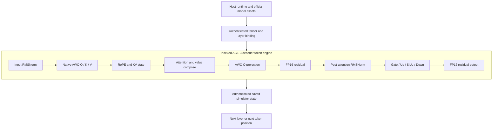

<div align="center">

# Argus Compute Engine 3 Mixed-Precision (ACE-3 MP)

### Evidence-first native-AWQ mixed-precision accelerator engineering

[English](README.md) | [简体中文](README.zh-CN.md)

[](LICENSE)
[](ace3/rtl/)
[](https://huggingface.co/Qwen/Qwen2.5-0.5B-Instruct-AWQ)
[](docs/STATUS.md)
[](https://github.com/Argus-AiTeam)
[](docs/STATUS.md)

**ACE means Argus Compute Engine. ACE-3 MP is designed, implemented, tested,
reviewed, and iterated primarily by
[Argus](https://argusbot.cn/) under human-owned objectives and release
authority.**

</div>

> **Current scope:** ACE-3 MP is a public development snapshot of a standalone
> native-AWQ accelerator. It publishes reviewed W4A16 RTL through a 24-layer
> decoder cascade and the infrastructure for authenticated Hybrid RTL
> generation. It does not yet claim an accepted readable RTL dialogue,
> synthesis, timing closure, PPA, FPGA execution, or silicon.

## Development at a glance

| Area | Current status |
|---|---|
| Official model | **Qwen2.5-0.5B-Instruct-AWQ revision pinned** |
| Native arithmetic | **Asymmetric INT4 AWQ, G128, FP16 activation path** |
| Projection | **Complete 896-input reductions and official tensor binding** |
| Decoder operators | **RMSNorm, RoPE, attention, SiLU/MLP, residual, FP16 KV** |
| Demonstrated model path | **24 indexed RTL decoder layers** |
| Official decoder tensors | **624 / 624 consumed in the accepted full-24 fixture** |
| Token 1 hidden-state error | **0.08988498970425507 maximum absolute error** |
| Host tied-head result | **Reference-matching Top-10 ordering; token ID 0 (`!`)** |
| Hybrid RTL dialogue | **Authenticated traversal in progress; not yet accepted** |
| Synthesis / PPA / FPGA | **Not yet claimed** |

The exact accepted, active, and excluded boundaries are maintained in
[Current status](docs/STATUS.md). The fixed official model revision is
`db09cd27ead7fee40cdee309693cf83601b9c899`.

## Why ACE-3 MP is an Argus result

ACE-3 MP is part of the wider body of work published by the
[Argus AI Team](https://github.com/Argus-AiTeam). Argus carried out the
iterative engineering loop: architecture decomposition, RTL and oracle
implementation, official-tensor integration, deterministic test generation,
long-running simulation, failure localization, evidence binding, independent
review handoffs, and fail-closed publication decisions. Human control remains
at the mission, budget, credential, and release boundaries.

This attribution is not a substitute for evidence. The repository separates
accepted results, operational runs, rejected candidates, and explicit
non-claims. A result is never promoted from software to RTL, from simulation to
hardware, or from an incomplete traversal to dialogue merely because the
higher-level system is planned.

## What ACE-3 MP contains

```mermaid
flowchart LR
    H[Host chat template and tokenizer] --> E[Embedding lookup]
    E --> N1[RTL input RMSNorm]
    N1 --> Q[Native AWQ Q / K / V projections]
    Q --> R[RoPE and persistent FP16 KV]
    R --> A[Attention score, softmax, value compose]
    A --> O[AWQ output projection and residual]
    O --> N2[RTL post-attention RMSNorm]
    N2 --> M[AWQ gate / up, FP16 SiLU, AWQ down]
    M --> D[Decoder output and residual]
    D --> L[Repeat across indexed layers 0 to 23]
    L --> F[Host final RMSNorm and tied LM head]
    F --> T[Greedy token, decode, and feedback]
```



The public source includes synthesizable SystemVerilog, independent bit-level
oracles, machine-readable contracts, official-model fixtures, Icarus and
Verilator harnesses, authenticated persistent-state logic, and reviewed
scope-bounded result notes. Model weights, generated simulator objects, bulky
execution traces, local agent state, and private infrastructure are not
distributed.

### Current RTL organization

ACE-3 MP uses one indexed decoder implementation across all 24 official model
layers rather than physically replicating 24 independent engines. The host
selects the layer and supplies its authenticated tensor set; the RTL performs
the layer arithmetic and maintains causal K/V state across token positions.



The current First Voice profile keeps chat serialization, tokenization,
embedding lookup, final RMSNorm, tied `lm_head`, greedy selection, decoding,
and feedback on the host. These are explicit accelerator-system boundaries,
not hidden software substitutes for decoder execution.

ACE-3 MP is an evidence-driven, pre-synthesis accelerator project for
mixed-precision transformer inference. It develops a complete native-AWQ
system boundary for the official
[`Qwen/Qwen2.5-0.5B-Instruct-AWQ`](https://huggingface.co/Qwen/Qwen2.5-0.5B-Instruct-AWQ)
checkpoint: packed asymmetric INT4 weights, group size 128, FP16 activations
and residuals, causal K/V state, decoder execution, host integration, and
reproducible verification.

ACE-3 MP is a standalone successor in the ACE hardware line. It does not
depend on an predecessor source tree, build directory, fixture path, runtime, or
evidence store. Reused architectural ideas are reimplemented or copied into
ACE-3-owned, provenance-tracked assets.

ACE-3 is developed with **[Argus](https://github.com/lbx154/Argus)**, the
open-source long-running agent harness used to plan, execute, review, and
preserve evidence across this engineering campaign.

## Project contract

| Item | Target |
| --- | --- |
| Model | Official Qwen2.5-0.5B-Instruct-AWQ, batch 1 |
| Initial precision | Native asymmetric AWQ W4A16, G128 |
| Decoder shape | 24 layers, hidden size 896, intermediate size 4,864 |
| Execution rule | Every represented token traverses indexed RTL layers 0–23 |
| Host boundary | Tokenizer, embeddings, final RMSNorm, tied `lm_head`, greedy selection, decode |
| Verification | Independent oracle, authenticated inputs, Icarus and Verilator |
| Delivery level | Reproducible RTL simulation before synthesis/PPA/FPGA claims |

The design covers model-bound tensor loading, native AWQ unpacking and
dequantization, complete projection reductions, FP16 normalization and
nonlinear operators, RoPE, causal K/V cache, attention and value composition,
decoder-layer integration, indexed 24-layer execution, authenticated persistent
simulator state, and the tokenizer/host/generation boundary needed for readable
autoregressive dialogue.

## Current status

ACE-3 is active research, not a synthesized implementation, FPGA deployment,
fabricated chip, or measured-performance result. The repository contains
independently reviewed RTL and evidence from the native G128 W4A16 arithmetic
lane through complete official projection reductions, FP16 residual/RMSNorm/
SiLU/RoPE operators, causal K/V state, attention, one integrated decoder layer,
and indexed execution across all 24 decoder layers.

The accepted full-24 fixture consumes all 624 official decoder tensors. Its
post-layer-23 Token 1 hidden state has maximum absolute error
`0.08988498970425507`, within the published `0.125` bound. Host final RMSNorm
and the tied software `lm_head` reproduce the independent reference Top-10
ordering and select token ID `0` (`!`) for the fixed `Hello world` fixture.
The Token 0/global maximum error remains `2.3170627008770595`; this FP16
boundary behavior is disclosed rather than hidden.

The current First Voice milestone extends that reviewed decoder into an
autoregressive system. Twenty-four compact indexed Verilator binaries have
been built operationally with savable state, authenticated predecessor
lineage, and caller-held trusted commitments. A genuine Hybrid RTL dialogue
traversal is in progress: every prompt token and every fed-back generated token
must pass through RTL layers 0–23 while preserving causal per-layer K/V state.
The host performs only chat serialization, tokenization, embedding lookup,
final RMSNorm, tied-head selection, decode, and feedback.

No readable RTL dialogue has been accepted yet. RTL final RMSNorm, a streaming
tied `lm_head`/Top-K unit, W8A16, BF16/FP16, larger-model tiers, synthesis,
timing closure, PPA, FPGA deployment, and measured hardware performance remain
future milestones.

## Repository map

| Path | Contents |
| --- | --- |
| `ace3/contracts/` | Machine-readable arithmetic, interface, lineage, and evidence contracts |
| `ace3/model/` | Independent bit-level oracles, vector tools, and host/runtime drivers |
| `ace3/rtl/` | Synthesizable SystemVerilog implementation |
| `ace3/tb/` | Icarus and Verilator testbenches |
| `ace3/fixtures/` | Small source-controlled model fixtures with provenance |
| `design/` | RTL manifest and requirement-to-evidence traceability |
| `docs/results/` | Reviewed, scope-bounded result notes |

Generated vectors, simulator objects, traces, model weights, and local agent
state are intentionally excluded from source control.

Start with [the documentation map](docs/INDEX.md),
[current status](docs/STATUS.md), [architecture](docs/ARCHITECTURE.md), and
[getting started](docs/GETTING_STARTED.md). The status page is authoritative
for accepted, active, and explicitly unclaimed results.

## Reproducible entry points

```sh
# List supported validation and Model24 entry points.
make help

# Run the standalone arithmetic oracle.
make oracle

# Run the source-controlled AWQ fixture regression.
make test

# Validate the published Model24 controller and source/unit evidence.
# This does not rerun the sealed full-24 numerical cascade.
make model24-publication-tests

# Run focused First Voice state-lineage and compact-builder checks.
make model24-first-voice-hybrid-tests
make model24-first-voice-compact-builder-tests

# Rerun the checkpoint-bound full-24 RTL cascade after preparing the
# official checkpoint and tokenizer described in docs/GETTING_STARTED.md.
make model24-controller-rtl-cascade
```

The basic regressions require Python 3.10 or newer, GNU Make, Icarus Verilog,
Verilator, and a C++ compiler. Model-bound execution additionally requires the
official checkpoint revision
`db09cd27ead7fee40cdee309693cf83601b9c899` and its tokenizer; these assets are
not redistributed by this repository.

The validation flow binds contracts, official tensor payloads, serialized
vectors, simulator binaries, and persistent state transitions with SHA-256.
Icarus provides bounded four-state checks while Verilator provides the
documented full numerical execution. Simulation cycles are not hardware
latency, and software execution is not RTL, FPGA, or silicon evidence.

Some flows require model assets, synthesis tools, or FPGA hardware that are not
bundled with this repository. Missing prerequisites are reported explicitly
rather than represented as successful synthesis, PPA, FPGA, or hardware runs.

For the ordered W4A16, W8A16, BF16/FP16, larger-model, and implementation
milestones, see the [roadmap](docs/ROADMAP.md).

## Engineering progression

1. Native asymmetric AWQ W4A16 G128 arithmetic and packing.
2. Complete official projection reductions across Q/K/V/O and MLP geometries.
3. FP16 RMSNorm, residual, RoPE, SiLU, and persistent K/V state.
4. Attention score, causal softmax, cached-value composition, and decoder
   integration.
5. Indexed 24-layer execution with all 624 official decoder tensors.
6. Authenticated Hybrid RTL prompt prefill and generated-token feedback.
7. RTL final RMSNorm and streaming tied `lm_head`/Top-K.
8. W8A16, then BF16/FP16, followed by larger model tiers.
9. Reproducible synthesis, timing, PPA, and FPGA evidence when the required
   tools and hardware are available.

Each step must preserve the previous accepted baseline or publish a new,
independently reviewed boundary. A planned downstream stage is never evidence
that an earlier execution stage has completed.

## What is proven, and what is not

**Proven within the published scope:** native AWQ arithmetic, official
projection geometry, bounded FP16 operators, attention and decoder
integration, indexed 24-layer RTL execution, authenticated persistent
simulator state, and the documented Host final-RMSNorm/tied-head interpretation
of the accepted fixture.

**Not yet proven:** an accepted readable multi-token RTL dialogue, RTL final
RMSNorm, RTL tied `lm_head`, synthesis, timing closure, area, power, FPGA
execution, hardware latency, throughput, or support for W8A16, BF16/FP16, 1.5B,
or 3B execution.

The active Hybrid RTL traversal is operational evidence until its complete
transaction chain, state lineage, generated token IDs, decoded text, and
independent reference comparison have been reviewed.

## Productization path

The immediate product milestone is the shortest honest readable dialogue in
which every prompt and generated token traverses all 24 RTL decoder layers
with persistent causal K/V state. The next boundary moves final RMSNorm and the
tied language-model head into RTL. Only after the complete model path is
reproducible does the project advance to synthesis, PPA, FPGA packaging, and
measured implementation work.

## Argus

Argus provides the long-horizon engineering loop behind ACE-3: backlog and
budget supervision, reusable skill matching, engineer execution, independent
review, checkpoints, and evidence-aware replanning.

- Source: <https://github.com/lbx154/Argus>
- ACE-3 remains the standalone hardware project; Argus is the general agent
  harness used to develop and supervise it.

## License

ACE-3 source is licensed under the [Apache License 2.0](LICENSE). Qwen model
assets remain subject to their upstream license and are not included in this
repository.
