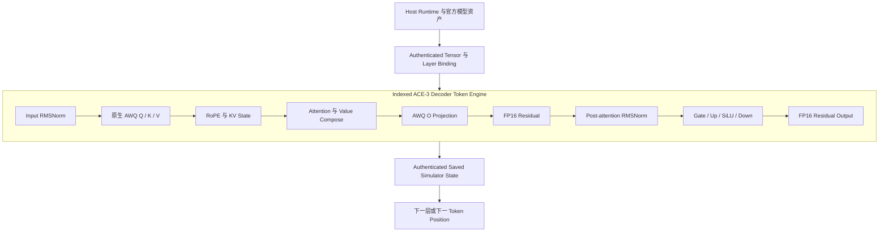

<div align="center">

# Argus Compute Engine 3 Mixed-Precision（ACE-3 MP）

### 以证据为核心的原生 AWQ 混合精度加速器工程

[English](README.md) | [简体中文](README.zh-CN.md)

[](LICENSE)
[](ace3/rtl/)
[](https://huggingface.co/Qwen/Qwen2.5-0.5B-Instruct-AWQ)
[](docs/STATUS.md)
[](https://github.com/Argus-AiTeam)
[](docs/STATUS.md)

**ACE 即 Argus Compute Engine。ACE-3 MP 的设计、实现、测试、审查和持续迭代
主要由 [Argus](https://argusbot.cn/) 在人类定义的目标与发布权限下自主完成。**

</div>

> **当前范围：** ACE-3 MP 是独立原生 AWQ 加速器的公开研发快照。它公开了经过
> 审核的 W4A16 RTL、24 层 decoder cascade，以及 authenticated Hybrid RTL 生成
> 基础设施。目前尚不声明验收通过的可读 RTL 对话、综合、时序收敛、PPA、FPGA
> 执行或硅片成果。

## 研发进展概览

| 项目 | 当前状态 |
|---|---|
| 官方模型 | **Qwen2.5-0.5B-Instruct-AWQ revision 已固定** |
| 原生算术 | **非对称 INT4 AWQ、G128、FP16 activation path** |
| Projection | **完整 896 输入 reduction 与官方 tensor 绑定** |
| Decoder 算子 | **RMSNorm、RoPE、attention、SiLU/MLP、residual、FP16 KV** |
| 已演示模型路径 | **24 个 indexed RTL decoder layers** |
| 官方 decoder tensor | **已验收 full-24 fixture 消耗 624 / 624** |
| Token 1 hidden-state 误差 | **最大绝对误差 0.08988498970425507** |
| Host tied-head 结果 | **Top-10 排序与 reference 一致；token ID 0（`!`）** |
| Hybrid RTL 对话 | **authenticated traversal 运行中，尚未验收** |
| 综合 / PPA / FPGA | **尚未声明** |

已验收、进行中和明确排除的精确边界统一记录在
[当前状态](docs/STATUS.md)。固定官方模型 revision 为
`db09cd27ead7fee40cdee309693cf83601b9c899`。

## 为什么 ACE-3 MP 是 Argus 的成果

ACE-3 MP 是 [Argus AI Team](https://github.com/Argus-AiTeam) 公开成果体系的一部分。
Argus 完成了主要迭代工程闭环：架构拆解、RTL 与 oracle 实现、官方 tensor 集成、
确定性测试生成、长时间仿真、失败定位、证据绑定、独立 Reviewer 交接和 fail-closed
发布决策。人类保留任务目标、预算、凭据和对外发布边界的最终控制权。

“由 Argus 制作”并不替代证据。仓库明确区分已验收结果、operational run、失败候选
和非声明边界。不能因为规划了更高层系统，就把软件结果升级成 RTL 结果、把仿真升级
成硬件结果，或把未完成 traversal 升级成对话能力。

## ACE-3 MP 包含什么

```mermaid
flowchart LR
    H[Host Chat Template 与 Tokenizer] --> E[Embedding Lookup]
    E --> N1[RTL Input RMSNorm]
    N1 --> Q[原生 AWQ Q / K / V Projection]
    Q --> R[RoPE 与持久 FP16 KV]
    R --> A[Attention Score、Softmax、Value Compose]
    A --> O[AWQ Output Projection 与 Residual]
    O --> N2[RTL Post-attention RMSNorm]
    N2 --> M[AWQ Gate / Up、FP16 SiLU、AWQ Down]
    M --> D[Decoder Output 与 Residual]
    D --> L[重复执行 Indexed Layers 0 至 23]
    L --> F[Host Final RMSNorm 与 Tied LM Head]
    F --> T[Greedy Token、Decode 与 Feedback]
```



公开源码包含可综合 SystemVerilog、独立 bit-level oracle、机器可读 contract、
官方模型 fixture、Icarus/Verilator harness、authenticated persistent-state logic，
以及经过审核且范围明确的结果说明。模型权重、生成的 simulator object、大型执行
trace、本地 agent state 和私有基础设施不随仓库分发。

### 当前 RTL 组织结构

ACE-3 MP 使用一套 indexed decoder 实现执行全部 24 个官方模型层，而不是在硬件中
物理复制 24 套独立 engine。Host 选择当前层并提供经过认证的 tensor set；RTL 执行
该层算术，并跨 token position 保持因果 K/V 状态。



当前 First Voice profile 把 chat serialization、tokenization、embedding lookup、
final RMSNorm、tied `lm_head`、greedy selection、decode 和 feedback 保留在 Host。
这些是明确的 accelerator system boundary，不是替代 decoder 执行的软件隐藏路径。

ACE-3 MP 是一个证据驱动、处于综合前阶段的混合精度 Transformer 推理加速器项目。
它面向官方
[`Qwen/Qwen2.5-0.5B-Instruct-AWQ`](https://huggingface.co/Qwen/Qwen2.5-0.5B-Instruct-AWQ)
checkpoint 建立完整的原生 AWQ 系统边界：非对称打包 INT4 权重、128 group size、
FP16 激活与残差、因果 K/V 状态、decoder 执行、Host 集成和可复现验证。

ACE-3 MP 是 ACE 硬件路线中的独立后继项目，不依赖 ACE-2 的源码树、build 目录、
fixture 路径、runtime 或 evidence store。需要复用的架构思想必须重新实现，或复制
为 ACE-3 自有且带 provenance 的资产。

ACE-3 由开源长期运行 agent harness
**[Argus](https://github.com/lbx154/Argus)** 持续规划、执行、独立审核和保存证据。

## 项目 Contract

| 项目 | 目标 |
| --- | --- |
| 模型 | 官方 Qwen2.5-0.5B-Instruct-AWQ，batch 1 |
| 首个精度 | 原生非对称 AWQ W4A16，G128 |
| Decoder 形状 | 24 层，hidden size 896，intermediate size 4,864 |
| 执行规则 | 每个 represented token 必须经过 indexed RTL layers 0–23 |
| Host 边界 | Tokenizer、embedding、final RMSNorm、tied `lm_head`、greedy selection、decode |
| 验证 | 独立 oracle、认证输入、Icarus 和 Verilator |
| 交付等级 | 先完成可复现 RTL 仿真，再声明综合/PPA/FPGA |

设计覆盖 model-bound tensor loading、原生 AWQ 解包与反量化、完整 projection
reduction、FP16 normalization 和非线性算子、RoPE、因果 K/V cache、attention 与
value composition、decoder-layer 集成、indexed 24 层执行、经过认证的持久
simulator state，以及可读自回归对话所需的 tokenizer/Host/generation 边界。

## 当前状态

ACE-3 仍是活跃研发项目，不是已经综合、部署到 FPGA、流片或完成真实性能测量的
实现。仓库已包含从原生 G128 W4A16 arithmetic lane，到完整官方 projection
reduction、FP16 residual/RMSNorm/SiLU/RoPE、因果 K/V 状态、attention、单个集成
decoder layer，再到全部 24 个 indexed decoder layers 执行的独立审核 RTL 与证据。

已验收的 full-24 fixture 使用了全部 624 个官方 decoder tensor。layer 23 后 Token 1
hidden state 的最大绝对误差为 `0.08988498970425507`，满足公开的 `0.125` bound。
Host final RMSNorm 与 tied software `lm_head` 重现了独立 reference 的 Top-10 排序，
并为固定 `Hello world` fixture 选择 token ID `0`（`!`）。Token 0/global 最大误差仍为
`2.3170627008770595`；这一 FP16 边界行为被明确披露，而不是隐藏。

当前 First Voice milestone 正在把已经审核的 decoder 扩展为自回归系统。24 个紧凑
indexed Verilator binary 已经完成 operational build，支持可保存状态、经过认证的
predecessor lineage 和 caller-held trusted commitment。真实 Hybrid RTL 对话
traversal 正在运行：每个 prompt token 和每个反馈生成 token 都必须通过 RTL layers
0–23，同时保持逐层因果 K/V 状态。Host 只负责 chat serialization、tokenization、
embedding lookup、final RMSNorm、tied-head selection、decode 和 feedback。

目前还没有验收通过的可读 RTL 对话。RTL final RMSNorm、streaming tied
`lm_head`/Top-K、W8A16、BF16/FP16、更大模型尺寸、综合、时序收敛、PPA、FPGA
部署和真实硬件性能仍属于后续 milestone。

## 仓库结构

| 路径 | 内容 |
| --- | --- |
| `ace3/contracts/` | 算术、接口、lineage 和证据的机器可读 contract |
| `ace3/model/` | 独立 bit-level oracle、向量工具和 Host/runtime driver |
| `ace3/rtl/` | 可综合 SystemVerilog 实现 |
| `ace3/tb/` | Icarus 和 Verilator testbench |
| `ace3/fixtures/` | 带 provenance 的小型源码内模型 fixture |
| `design/` | RTL manifest 与 requirement-to-evidence traceability |
| `docs/results/` | 经审核、范围明确的结果说明 |

生成向量、仿真对象、trace、模型权重和本地 agent 状态不属于源码。

建议从[文档导航](docs/INDEX.md)、[当前状态](docs/STATUS.md)、
[架构](docs/ARCHITECTURE.md)和[快速上手](docs/GETTING_STARTED.md)开始。
其中状态页是已验收、进行中和明确未声明结果的权威说明。

## 可复现入口

```sh
# 列出支持的验证与 Model24 入口。
make help

# 运行独立算术 oracle。
make oracle

# 运行源码内 AWQ fixture regression。
make test

# 验证公开的 Model24 controller 与 source/unit evidence；
# 不会重跑已经 sealed 的 full-24 numerical cascade。
make model24-publication-tests

# 运行 First Voice state-lineage 和 compact-builder 定向检查。
make model24-first-voice-hybrid-tests
make model24-first-voice-compact-builder-tests

# 按 docs/GETTING_STARTED.md 准备官方 checkpoint 和 tokenizer 后，
# 运行 checkpoint-bound full-24 RTL cascade。
make model24-controller-rtl-cascade
```

基础 regression 需要 Python 3.10 或更新版本、GNU Make、Icarus Verilog、Verilator
和 C++ 编译器。完整模型执行还需要固定官方 revision
`db09cd27ead7fee40cdee309693cf83601b9c899` 的 checkpoint 与 tokenizer；仓库不会
重新分发这些资产。

验证流程使用 SHA-256 绑定 contract、官方 tensor payload、serialized vector、
simulator binary 和持久状态转换。Icarus 提供有界四态检查，Verilator 执行文档明确
范围内的完整数值路径。仿真 cycle 不是硬件 latency，软件执行也不是 RTL、FPGA 或
silicon 证据。

部分流程需要仓库未附带的模型资产、综合工具或 FPGA 硬件。缺失 prerequisite 会被
明确报告，不会被描述成成功的综合、PPA、FPGA 或硬件运行。

W4A16、W8A16、BF16/FP16、更大模型和实现证据的有序计划见
[路线图](docs/ROADMAP.md)。

## 工程演进

1. 原生非对称 AWQ W4A16 G128 算术与 packing；
2. Q/K/V/O 和 MLP 全部几何的完整官方 projection reduction；
3. FP16 RMSNorm、residual、RoPE、SiLU 与持久 K/V 状态；
4. Attention score、causal softmax、cached-value composition 与 decoder 集成；
5. 消耗全部 624 个官方 decoder tensor 的 indexed 24 层执行；
6. Authenticated Hybrid RTL prompt prefill 与 generated-token feedback；
7. RTL final RMSNorm 与 streaming tied `lm_head`/Top-K；
8. W8A16、BF16/FP16 和更大模型尺寸；
9. 在工具与硬件可用后获得可复现综合、时序、PPA 和 FPGA 证据。

每一步都必须保留此前已验收基线，或发布新的独立审核边界。规划中的后续 stage
不能作为前序执行已经完成的证据。

## 已经证明什么，尚未证明什么

**公开范围内已经证明：** 原生 AWQ 算术、官方 projection geometry、有界 FP16
算子、attention 与 decoder 集成、indexed 24 层 RTL 执行、authenticated persistent
simulator state，以及已验收 fixture 上的 Host final-RMSNorm/tied-head interpretation。

**尚未证明：** 验收通过的可读多 token RTL 对话、RTL final RMSNorm、RTL tied
`lm_head`、综合、时序收敛、面积、功耗、FPGA 执行、硬件 latency/throughput，以及
W8A16、BF16/FP16、1.5B 或 3B 的实际执行。

当前 Hybrid RTL traversal 在完整 transaction chain、state lineage、generated token
ID、decoded text 和独立 reference comparison 通过审核前，只属于 operational
evidence。

## 产品化路径

当前最近的产品 milestone，是完成最短但真实的可读对话：每个 prompt 和生成 token
都必须经过全部 24 个 RTL decoder layer，并保持持久因果 K/V 状态。下一边界会把
final RMSNorm 和 tied language-model head 移入 RTL。只有完整模型路径可复现后，
项目才进入综合、PPA、FPGA packaging 和真实性能测量阶段。

## Argus

Argus 为 ACE-3 提供长期工程循环：backlog 与预算监督、skill 匹配、engineer 执行、
独立 reviewer、checkpoint 和基于证据的重新规划。

- 源码：<https://github.com/lbx154/Argus>
- ACE-3 是独立硬件项目；Argus 是用于研发和监督它的通用 agent harness。

## 许可证

ACE-3 源码采用 [Apache License 2.0](LICENSE)。Qwen 模型资产遵循上游许可证，
不包含在本仓库中。
